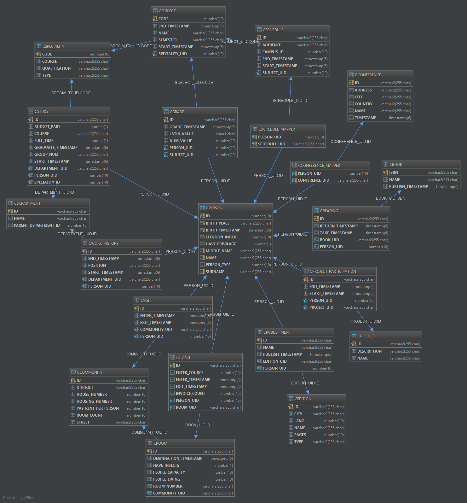

# Oracle Database Aggregator

Aggregates data from multiple databases and sync all in Oracle database.

## Build & Run locally

Install Oracle Database.

Download repository.

Download [oJDBC (ojdbc7.jar)](https://www.oracle.com/technetwork/database/features/jdbc/jdbc-drivers-12c-download-1958347.html) and put it in */driver* folder inside project root.
Rename file to *ojdbc7-12.1.0.2.jar*

Set environment variables (Or [default will be used](/build.gradle)):
* ORA_USER - database user
* ORA_PASS - database password
* ORA_URL - database url (like *jdbc:oracle:thin:@localhost:1521:ORCLCDB*)

Build & Run with:
```bash
./gradlew bootRun
```

## Build & Run with Docker

Order of execution: *Build -> Up -> Stop*

Run (add *-d* to use detached mode or it will be interactive)
```bash
docker-compose up --build
```

Stop
```bash
docker-compose stop
```

### Endpoints

All server endpoints at - *localhost:8080/swagger-ui.html*

Learn more about [swagger ui](https://swagger.io/tools/swagger-ui/)

There are specific *load* & *load test* endpoints for each database with specific name for such database.

### Common Schema


### JSON Example

[People List JSON schema](https://pastebin.com/RDV7tqd6)