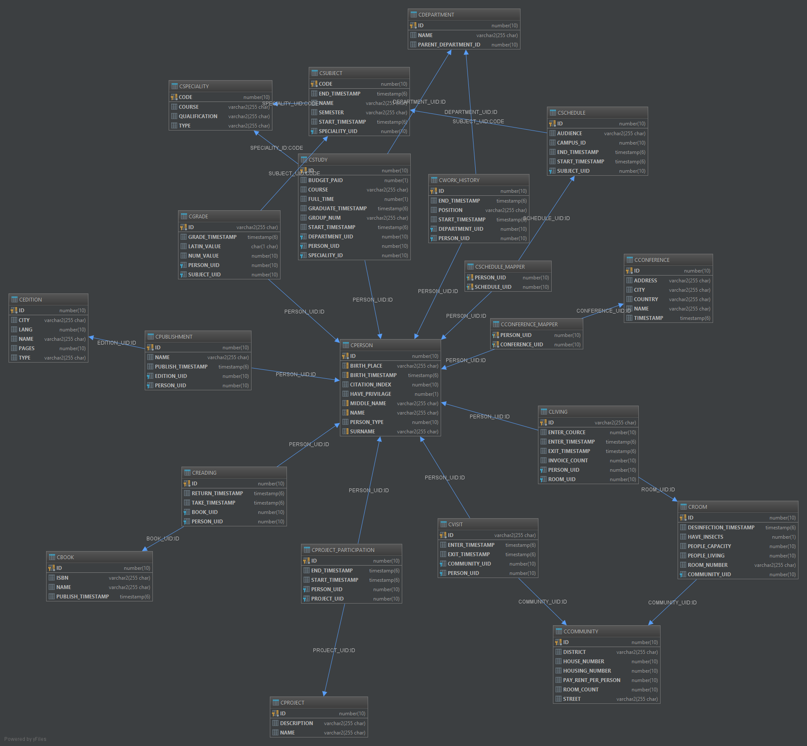

# Oracle Database Aggregator

Aggregates data from *postgres* and *oracle provider* and sync data in Oracle database.

## Build & Run locally

Steps to do:
* Install Postgres Database (for *Postgres provider*).
* Install Oracle Database (for *Aggregator and Oracle provider*).
* Download repository.
* Download [oJDBC (ojdbc7.jar)](https://www.oracle.com/technetwork/database/features/jdbc/jdbc-drivers-12c-download-1958347.html)
* Rename file to *ojdbc7-12.1.0.2.jar*
* Create **driver** folder inside *oracle* and *aggregator* projects 
* Put renamed oracle database driver in those folders

Build projects with:
```bash
./gradlew bootJar
```

You can change environment variables if you want non default, check *gradle.properties* file for each module.

Execute (Located in /build/libs for each project):
```bash
java -jar aggregator-1.0.0.jar
java -jar oracle-1.0.0.jar
java -jar postgres-1.0.0.jar
```

## Build & Run with Docker

Docker-compose starts *databases only*

Run (add *-d* to use detached mode or it will be interactive, *--build* flag allows to build/rebuild images)
It may take *time* (for oracle database to start)
```bash
docker-compose up
```

Stop
```bash
docker-compose down
```

Then you should *docker run* each dockerfile representing each project:
* [Postgres provider](Dockerfile_postgres)
* [Oracle provider](Dockerfile_oracle)
* [Aggregator provider](Dockerfile_aggregator)

All projects not in one docker-compose due to DB connect issues from inside containers and etc.

### Endpoints

Services endpoints (for default values):
* Aggregator - *localhost:8080/swagger-ui.html*
* Oracle provider - *localhost:8081/swagger-ui.html*
* Postgres provider - *localhost:8082/swagger-ui.html*

Learn more about [swagger ui](https://swagger.io/tools/swagger-ui/)

There are specific *load* & *load test* endpoints for each database with specific name for such database.

### Aggregator Common Schema


### JSON Example

[JSON schema](https://pastebin.com/nsycLfgE)